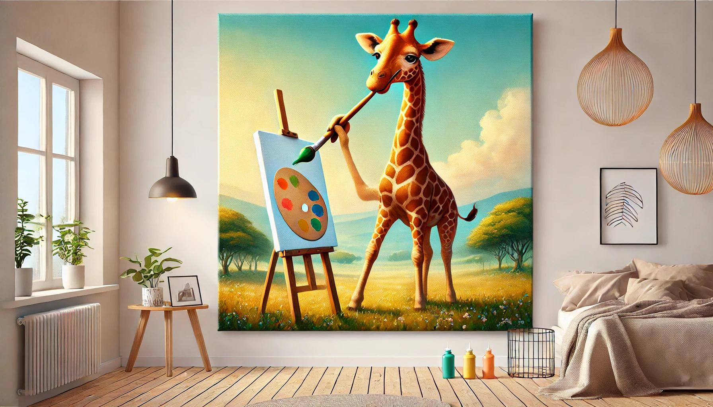
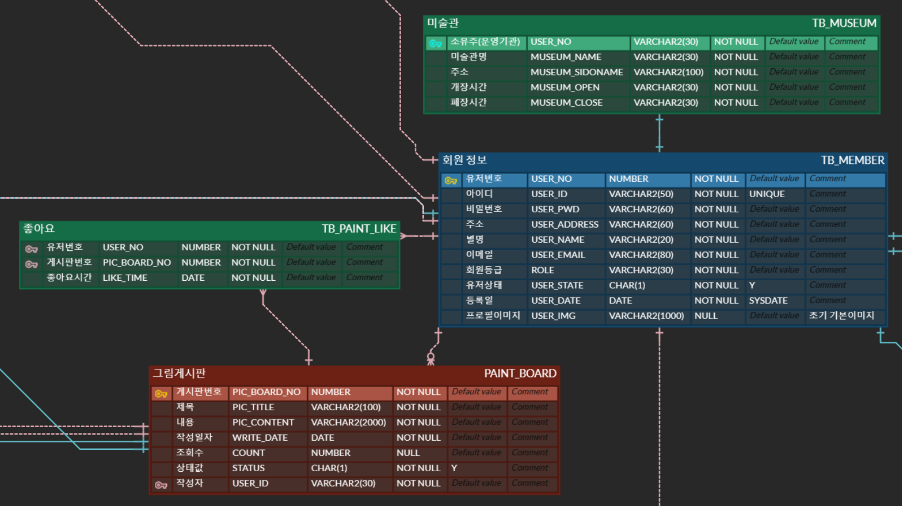

# 🦒 내가기린그린그림

    

 

## ✅ 주제

사용자가 직접 그린 그림을 기반으로 한 그림 공유 및 예술적 체험 사이트

 

## 📅 기간

-   2025.02.05 - 2025.02.26.

 

## 📜 프로젝트 컨셉 및 주요 기능

### 1️⃣ 기획 배경 및 목적

- 아무도 안 해 볼 법한 기능, 사이트에서 흔히 볼 수 없는 기능을 만들어보자는 의도로 그림판에 그림그리기 프로젝트를 기획
- 그림을 통해 다양한 사람들과 소통하고 유사적이나 화가, 미술관 관장과 같은 체험을 할 수 있도록 구현

 

### 2️⃣ 담당 기능

**미술관**

- 사용자가 직접 그림판에 열심히 그린 그림을 어떤 방식으로 더 향유할 수 있을까 라는 생각으로 회원제 미술관 창설 기능 고안하였다.

- 등록된 전체 그림 중 조회수 순으로 등재되는 ‘명예의 전당’을 관람하기 위한 미술관을 회원제로 창설한다.
- 보다 현실적인 체험을 위하여, 공공데이터 API와 지도 API를 활용하여 회원은 실제로 ‘매각준비’ 중인 공매 대상 건물의 주소로 미술관을 창설하면 지도에 마커로 표시된다.
- 또한, 실제 국립 미술관도 API를 통해 지도에 마커로 표시하여 두 종류의 미술관을 구분함으로써 회원이 창설한 미술관은 사이트 상의 가상건물이지만 유사 미술관 관장 경험이 가능

 

## 💻 개발 환경

### 1️⃣ 활용 기술

#### Back-End

#### Front-End

#### Tools

 

### 2️⃣ ERD

  

